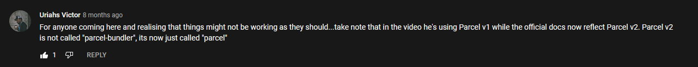

# Yu-Gi-Oh-OOP!
This will be a rather challenging personal task.
I want to try and make a Yu-Gi-Oh game, made on Javascript using OOP.
###### If I'm able to pull this off, I might remake the fighting system of the game Megaman Battle Network.

---
## I Summon 'Elemental Hero: Programmer' in Attack Mode!
I'd like to imagine that I know enough about Yu-Gi-Oh since I grew up playing/watching it.
But just to be sure, I'll be playing the **critically acclaimed** game Yu-Gi-Oh GX: Duel Academy on my good ol' Gameboy Micro.
I just want to clarify that the following things that I wrote down are meant to help me visualize better how to tackle this ginormous project.

The way I think I should tackle this, is by creating the following classes:
### Cards
* Monster Cards (normal monsters)
  * Effect Monsters
* Magic Cards
  * Spell Cards
  * Trap Cards

**Cards** Possess:
* Name 
* Image
* Description / Effect Description

**Monster Cards** Possess:
* Attack
* Defense
* Attack Mode
* Defense Mode
* Stars
  * Determines normal summon or sacrifice

**Monster Cards** Functions:
* From hand or deck
  * Summon
  * Special Summon (later)
* From field
  * Set to
    * Attack Mode
    * Defense Mode
  * Attack

Effect Monsters Possess: 
* Effect Type
  * Flip Effects, if monster flipped, then =>
    * Action that happens when effect activated
  * Summon Effects, if monster is summoned, then =>
    * Action that happens when effect is activated
  * Cards on the field effects, if there is a card with 'example' in their name, then =>
    * Action that happens when the effect is activated
  * ...

### Player and CPU
* Player
  * CPU

Player and CPU possess:
* Health
* A Deck
  * Made out of Cards
* A Hand
  * Made out of Cards

### Field
* Player Side / CPU side
  * Monster Field
    * 5 slots
  * Spell/Trap Field
    * 5 Slots
  * Health
  * Graveyard

## Every Phase/Turn a Class
I think that, theoretically, it should be possible to add the game rules like this

Create a class called 'Turns', every function in this class = a turn
Set all turns to negative, when gameStarts() -> set the turn that comes after it to true, and if that turn is set to true, that function will be called.
-> Is this possible?
(Probably need to add variables that are all set to false, and if those variables are set to true = start the corresponding turn)

First turn => skips attack turn

## I will be following this order
1. Cards
   1. Monster Cards
      1. Normal Monsters
      2. Effect Monsters
2. Field
3. Player/CPU
4. Magic Cards
   1. Spell Cards
   2. Trap Cards
5. ...

---

## Bundlers, it can be your angle, or yuor devil...
I received some feedback from one of the coaches, who told me two things.
For this very, very, **very**, **VERY** beefy project two work, I should checkout:
* Typescript
* Bundlers

Now typescript was relatively easy to get into.
I decided that once I'm done with the bundler and I can use all my scripts, I would remove all the JS files and replace them with Typescript files.
But using a bundler, on the other hand.
Now that took a lot more time than I previously had imagined.

I decided to use Parcel. 
But, like almost every single person that has ever set one molecule of their being into the IT-sector, I ran into some issues.
After a lot of trial and error, I was finally able to resolve it.
When installing parcel on your computer, I accidentally installed the older version of parcel.
The one with **a lot** of security issues.
But thanks to a random comment on Youtube, I was finally able to console log my very first Yu-Gi-Oh card on the site.
So here's a quick shout-out to Uriahs Victor on Youtube, you saved my life buddy!

With that headache and a half out of the way, I can finally focus on making the same card appear on the site again.
But this time in Typescript.

## Future Features Ft. Future
Things I'd like to add in the future of this project:
* Different Decks
  * At the start of the game, let the player choose what kind of deck they want to use.
    * Machine Deck
    * Spellcaster Deck
    * The BeCode Deck (my personal favourite)
      * Ask the fellow learners at BeCode to design their own cards, and create a deck out of these cards
      * Some examples at the top of my head are:
      * Spellcard - VDAB = "Sacrifice 1 'Learner' or 'Coach' card on your side of the field, to inflict 1000 healthpoints of damage directly to your opponent"
      * Trapcard - PHP: The Hill = "When an enemy summons a monster card on the field, destroy the summoned monster card"
      * Effect Monster Card - Besart, The Creator: "When this monster has been summoned on your side of the field, destroy all the face-down monster cards on your opponents side of the field"
      * ...
* Fusion Summons
* Legendary Cards
* Exodia
  * This is a monster, that's made out of 5 cards 'the 5 pieces of exodia'.
  * If the player has all 5 cards in their hand, they automatically win
* Spell cards that control enemy cards
* Monster reborn
  * Returns monster from the graveyard to your field
* ...

